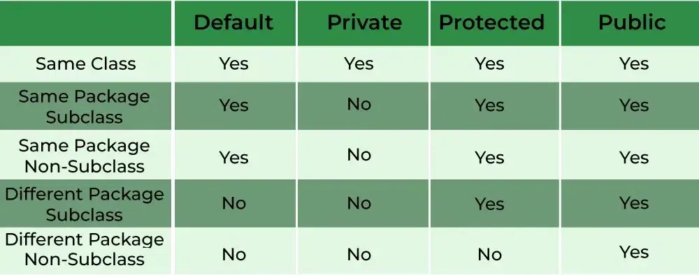

## Packages
- A package is a container that groups related types (classes, interfaces, enumerations & annotations)

## Importing a package
_IMP: import statement is written directly after the package statement and before the class definition_

## Accesss modifiers
- Access modifiers are used to set theaccessibility of classes, interfaces, variables, methods, constructors, data memebers and setter methods.

_The 4 access modifiers in java are -_
- Default 
- public
- private
- protected

## Encapsulation
- Encapsulation is the bundling of related fields and methods together. 
- We achieve encapsulation with the help of access modifiers
- Encapsulation can be used to achieve data hiding

## Getter & Setter

## static keyword
- if we want to access class members without creating an instance of the class, we need to declare the class members static.
- static variables can be accessed by calling the class name of the class. There is no need to create an instance of the class for acccessing the static variables because static variables are the class variables and are shared among all the class instances. 
- Only a single copy of the static variable is created and shared among all the instances of the class.
- Because it is a class-level variable, memory allocation of such variables only happens once when the class is loaded in the memory.
- If an object modifies the value of a static variable, the change is reflected across all objects.
- Static variables can be used in any type of method: static or non-static.
- Non-static variables cannot be used inside static methods. It will throw a compile-time error.

## static block